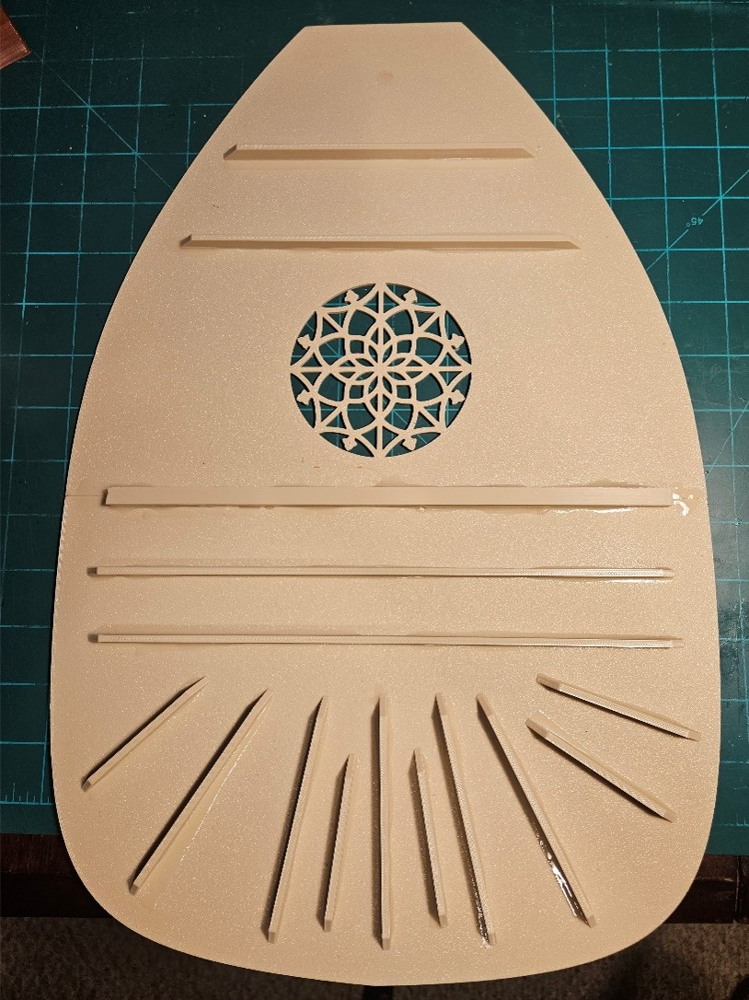

# OL-R1 — 7-Course Renaissance Lute

## Build Guide

This guide describes the current assembly process for the OL-R1 7-course Renaissance lute.

The design is experimental and may change as additional builds are completed and tested.

---

## 1. Bowl Assembly

### Parts

* Bowl half × 2

### Assembly

1. Print both bowl halves.
2. Take care when removing supports. The dovetail features are somewhat fragile and may require additional strengthening in future revisions.
3. Test-fit the two halves and make sure the dovetails are properly aligned.
4. Apply epoxy to the mating edges of the bowl halves.
5. Assemble the two halves and place the bowl with the open side facing down while the epoxy cures. This helps maintain alignment and produces a tight seal along the joint.
6. Once the initial epoxy has cured, turn the bowl over.
7. Fill any remaining gaps with epoxy.
8. Apply additional epoxy along the inside of the joint to reinforce the connection.

Allow the epoxy to fully cure according to the manufacturer's instructions before proceeding.

---

## 2. Soundboard Assembly

### Parts

* Soundboard half × 2
* SndBrd-Connector × 1
* SndBrd-Top Brace1 × 1
* SndBrd-Top Brace2 × 1
* SndBrd-Bot-Brace1 × 1
* SndBrd-Bot-Brace2 × 1
* SndBrd-Bot-Brace3 × 5

### Assembly

1. Print both soundboard halves.
2. Epoxy the two soundboard halves together.
3. Print the soundboard support pieces listed above.
4. Glue the support pieces to the underside of the soundboard according to the image below.

5. Allow the adhesive to fully cure before attaching the soundboard to the bowl.

---

## 3. Neck Assembly

### Parts

* Neck
* Bowl assembly

### Assembly

1. Glue the neck to the completed bowl assembly.
2. Carefully align the neck with the centerline of the instrument.
3. Flip the assembly over and place it on a flat surface while the adhesive cures. This helps keep the assembly flat and properly aligned.
4. Allow the adhesive to fully cure before continuing.

---

## 4. Fingerboard

### Parts

* Fingerboard
* Neck assembly

### Assembly

1. Once the neck is attached to the bowl, position the fingerboard on the neck.
2. Check the alignment of the fingerboard with the neck and centerline of the instrument.
3. Glue the fingerboard to the neck.
4. Allow the adhesive to fully cure before continuing.

---

## 5. Pegbox Reinforcement

The pegbox is reinforced using a 1/4-inch diameter rod.

### Parts

* 1/4-inch diameter reinforcement rod
* Epoxy

### Reinforcement Rods

Cut the following sections from the 1/4-inch rod:

* **1 × 7 1/8-inch section** — pegbox reinforcement shaft
* **2 × 1 3/8-inch sections** — neck reinforcement sections

### Pegbox Reinforcement

1. Cut one 7 1/8-inch section of 1/4-inch diameter rod.
2. Insert the rod into the reinforcement shaft in the pegbox.
3. Secure the rod in place with epoxy.
4. Allow the epoxy to cure.

### Neck Reinforcement

The two 1 3/8-inch sections are installed when the pegbox is joined to the neck.

1. Do not install these sections during the initial pegbox reinforcement step.
2. When joining the pegbox to the neck, apply epoxy to the appropriate ends of the reinforcement rods.
3. Join the pegbox and neck while ensuring the reinforcement rods are properly aligned.
4. Allow the epoxy to fully cure before applying load to the assembly.

---

## 6. Soundboard to Bowl Assembly

Once the soundboard assembly is complete:

1. Test-fit the soundboard assembly to the bowl.

2. Verify that the soundboard is correctly aligned with the bowl and neck.

3. Apply adhesive around the mating surface.

4. Position the soundboard on the bowl.

5. The soundboard extends slightly beyond the bowl at the bridge end.

   This appears to be related to dimensional differences or shrinkage in the printed bowl. The slight overhang is intentional in the current build and provides an area where additional epoxy can be applied to reinforce the connection between the soundboard and bowl.

6. Apply additional epoxy in the overhang area to reinforce the bond between the soundboard and bowl.

7. Secure the assembly in position while the adhesive cures.

8. Allow the adhesive to fully cure before proceeding.

---

## Assembly Notes

This build guide documents the current experimental assembly process for OL-R1.

As additional instruments are built, these instructions may be updated to reflect improved assembly methods, revised components, or lessons learned from testing.

When building an OL-R1, refer to the current design files and documentation rather than relying on instructions from older versions of the design.
